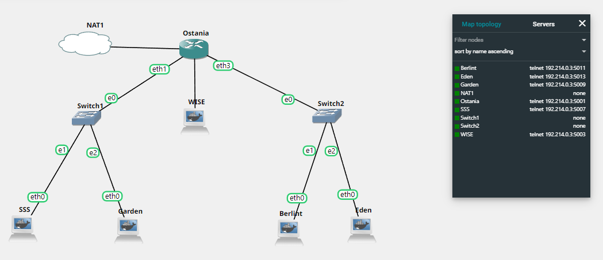
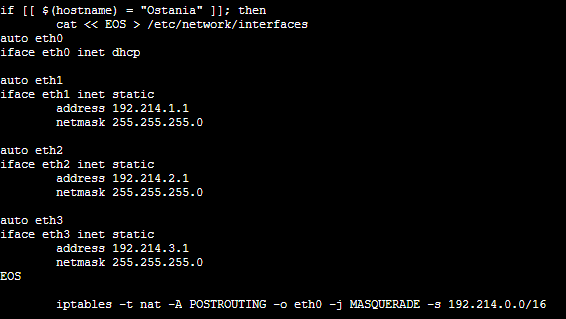
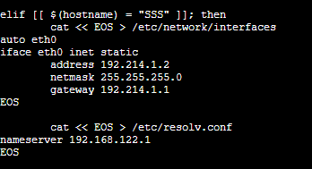
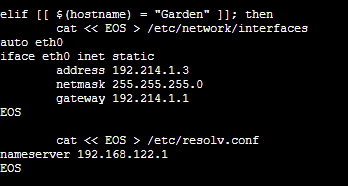
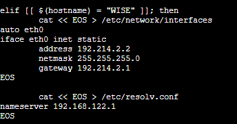
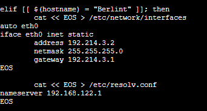
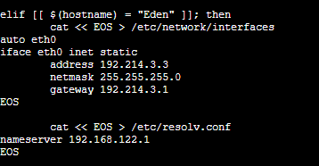

# Jarkom-Modul-2-ITA10-2022
**Laporan Resmi praktikum Jarkom kelompok ITA10**
<br>
Kelompok:
- Muhammad Farrel Abdillah (50272010570)
- Hafizh Abid Wibowo (5027201011)
<br>
Berikut adalah Dokumentasi dan langkah pengerjaan untuk laporan resmi praktikum jarkom modul 2
<br>

# **Topologi**
<br>

<br>
 <br>
 Berikut adalah screenshot konfigurasi dari setiap komputer dalam topologi
 <br>
 Router:
 <br>
 
 <br>
 Node:
 <br>
 
 <br>
 
 <br>
 
 <br>
 
 <br>
 

# **Langkah Pengerjaan**
<br>
Nomor 2:
Untuk mempermudah mendapatkan informasi mengenai misi dari Handler, bantulah Loid membuat website utama dengan akses wise.yyy.com dengan alias www.wise.yyy.com pada folder wise 
<br>
Memasukkan

```
zone "wise.ita10.com" {
    type master;
    file "/etc/bind/jarkom/wise/wise.ita10.com";
};
```
di /etc/bin/named.conf.local di node WISE
 
Memasukkan 
```
\$TTL   604800
@       IN      SOA     wise.ita10.com. root.wise.ita10.com. (
                        2022102401      ; Serial
                         604800         ; Refresh
                          86400         ; Retry
                        2419200         ; Expire
                         604800 )       ; Negative Cache TTL
;
@       IN      NS      wise.ita10.com.
@       IN      A       192.214.3.3
www     IN      CNAME   wise.ita10.com.
```
di /etc/bind/jarkom/wise/wise.ita10.com pada node WISE

<br>
Nomor 3:
Setelah itu ia juga ingin membuat subdomain eden.wise.yyy.com dengan alias www.eden.wise.yyy.com yang diatur DNS-nya di WISE dan mengarah ke Eden 
<br>

Memasukkan 
```
zone "eden.wise.ita10.com" {
    type master;
    file "/etc/bind/jarkom/eden/eden.wise.ita10.com";
};
```
di /etc/bin/named.conf.local di node WISE

Memasukkan 
```
\$TTL   604800
@       IN      SOA     eden.wise.ita10.com. root.eden.wise.ita10.com. (
                        2022102401      ; Serial
                         604800         ; Refresh
                          86400         ; Retry
                        2419200         ; Expire
                         604800 )       ; Negative Cache TTL
;
@       IN      NS      eden.wise.ita10.com.
@       IN      A       192.214.3.3
www     IN      CNAME   eden.wise.ita10.com.
```
di /etc/bind/jarkom/eden/eden.wise.ita10.com pada node WISE

<br>
Nomor 4:
Buat juga reverse domain untuk domain utama
<br>

Memasukkan 
```
zone "2.214.192.in-addr.arpa" {
    type master;
    file "/etc/bind/jarkom/3.214.192.in-addr.arpa";
};
```
di /etc/bin/named.conf.local di node WISE

Memasukkan 
```
cat << EOS > /etc/bind/jarkom/3.214.192.in-addr.arpa
\$TTL   604800
@       IN      SOA     wise.ita10.com. root.wise.ita10.com. (
                        2022102401     ; Serial
                         604800         ; Refresh
                          86400         ; Retry
                        2419200         ; Expire
                         604800 )       ; Negative Cache TTL
;
3.214.192.in-addr.arpa. IN      NS      wise.ita10.com.
3       IN      PTR     wise.ita10.com.
```
di /etc/bind/jarkom/3.214.192.in-addr.arpa pada node WISE

<br>
Nomor 5:
Agar dapat tetap dihubungi jika server WISE bermasalah, buatlah juga Berlint sebagai DNS Slave untuk domain utama
<br>

Menambahkan 
```
allow-transfer { 192.214.3.2; };
```
pada zone "wise.ita10.com"


Memasukkan 
```
zone "wise.ita10.com" {
    type slave;
    masters { 192.214.2.2; };
    file "/var/lib/bind/wise.ita10.com"; 
};
```
di /etc/bin/named.conf.local di node BERLINT

<br>
Nomor 6:
Karena banyak informasi dari Handler, buatlah subdomain yang khusus untuk operation yaitu operation.wise.yyy.com dengan alias www.operation.wise.yyy.com yang didelegasikan dari WISE ke Berlint dengan IP menuju ke Eden dalam folder operation 
<br>

Menambahkan 
```
ns1             IN              A               192.214.3.2
operation       IN              NS              ns1
```
pada /etc/bind/jarkom/wise/wise.ita10.com di node WISE

Menambahkan 
```
zone "operation.wise.ita10.com" {
    type master;
    file "/etc/bind/delegasi/operation/operation.wise.ita10.com";
};
```
di /etc/bind/named.conf.local di node BERLINT

Menambahkan
```
\$TTL   604800
@       IN      SOA     operation.wise.ita10.com. root.operation.wise.ita10.com. (
                        2022102401      ; Serial
                         604800         ; Refresh
                          86400         ; Retry
                        2419200         ; Expire
                         604800 )       ; Negative Cache TTL
;
@       IN      NS      operation.wise.ita10.com.
@       IN      A       192.214.3.3
www     IN      CNAME   operation.wise.ita10.com.
```
di /etc/bind/delegasi/operation/operation.wise.ita10.com di node BERLINT

Menambahkan
```
options {
    directory "/var/cache/bind";

    //dnssec-validation auto;
    allow-query{any;};
    auth-nxdomain no;    # conform to RFC1035
    listen-on-v6 { any; };
};
```
di /etc/bind/named.conf.options pada node BERLINT dan WISE

<br> 
Nomor 7:
Untuk informasi yang lebih spesifik mengenai Operation Strix, buatlah subdomain melalui Berlint dengan akses strix.operation.wise.yyy.com dengan alias www.strix.operation.wise.yyy.com yang mengarah ke Eden 

Menambahkan
```
zone "strix.operation.wise.ita10.com" {
    type master;
    file "/etc/bind/jarkom/operation/strix/strix.operation.wise.ita10.com";
};
```
di /etc/bind/named.conf.local pada node BERLINT

Menambahkan
```
\$TTL   604800
@       IN      SOA     strix.operation.wise.ita10.com. root.strix.operation.wise.ita10.com. (
                        2022102401      ; Serial
                         604800         ; Refresh
                          86400         ; Retry
                        2419200         ; Expire
                         604800 )       ; Negative Cache TTL
;
@       IN      NS      strix.operation.wise.ita10.com.
@       IN      A       192.214.3.3
www     IN      CNAME   strix.operation.wise.ita10.com.
```
di /etc/bind/jarkom/operation/strix/strix.operation.wise.ita10.com pada node BERLINT

<br> 
Nomor 8:
