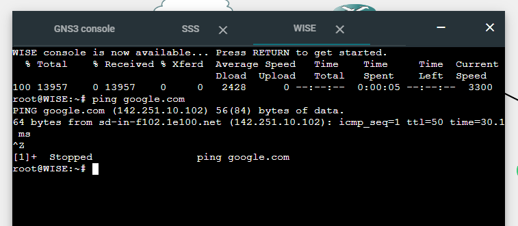
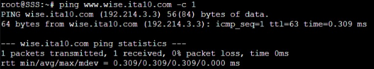
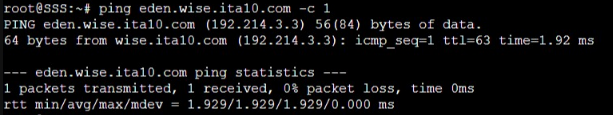
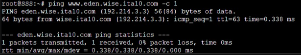
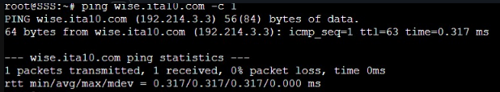
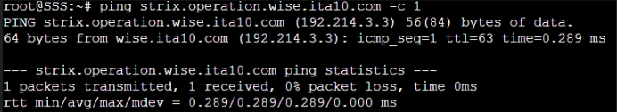
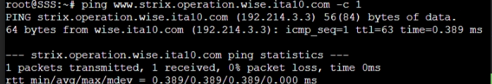

# Jarkom-Modul-2-ITA10-2022
**Laporan Resmi praktikum Jarkom kelompok ITA10**
<br>
Kelompok:
- Muhammad Farrel Abdillah (50272010570)
- Hafizh Abid Wibowo (5027201011)
<br>
Berikut adalah Dokumentasi dan langkah pengerjaan untuk laporan resmi praktikum jarkom modul 2
<br>

# **Topologi**

<br>
 Berikut adalah screenshot konfigurasi dari setiap komputer dalam topologi
 <br>
 Router:
 <br>
 
 <br>
 Node:
 <br>
 
 <br>
 
 <br>
 
 <br>
 
 <br>
 
 <br>
 Test ping ke google.com:
 <br>
 
 <br> 

# **Langkah Pengerjaan**
Nomor 2:
Untuk mempermudah mendapatkan informasi mengenai misi dari Handler, bantulah Loid membuat website utama dengan akses wise.yyy.com dengan alias www.wise.yyy.com pada folder wise 
<br>
Memasukkan

```
zone "wise.ita10.com" {
    type master;
    file "/etc/bind/jarkom/wise/wise.ita10.com";
};
```
di /etc/bin/named.conf.local di node WISE
 
Memasukkan 
```
$TTL   604800
@       IN      SOA     wise.ita10.com. root.wise.ita10.com. (
                        2022102401      ; Serial
                         604800         ; Refresh
                          86400         ; Retry
                        2419200         ; Expire
                         604800 )       ; Negative Cache TTL
;
@       IN      NS      wise.ita10.com.
@       IN      A       192.214.3.3
www     IN      CNAME   wise.ita10.com.
```
di /etc/bind/jarkom/wise/wise.ita10.com pada node WISE
<br>
<br>
Test ping ke wise.ita10.com:
<br>

<br>

<br> 

<br>
Nomor 3:
Setelah itu ia juga ingin membuat subdomain eden.wise.yyy.com dengan alias www.eden.wise.yyy.com yang diatur DNS-nya di WISE dan mengarah ke Eden 
<br>

Memasukkan 
```
zone "eden.wise.ita10.com" {
    type master;
    file "/etc/bind/jarkom/eden/eden.wise.ita10.com";
};
```
di /etc/bin/named.conf.local di node WISE

Memasukkan 
```
$TTL   604800
@       IN      SOA     eden.wise.ita10.com. root.eden.wise.ita10.com. (
                        2022102401      ; Serial
                         604800         ; Refresh
                          86400         ; Retry
                        2419200         ; Expire
                         604800 )       ; Negative Cache TTL
;
@       IN      NS      eden.wise.ita10.com.
@       IN      A       192.214.3.3
www     IN      CNAME   eden.wise.ita10.com.
```
di /etc/bind/jarkom/eden/eden.wise.ita10.com pada node WISE
<br>
<br>
Test ping ke eden.wise.ita10.com:
<br>

<br>

<br> 

<br>
Nomor 4:
Buat juga reverse domain untuk domain utama
<br>

Memasukkan 
```
zone "2.214.192.in-addr.arpa" {
    type master;
    file "/etc/bind/jarkom/3.214.192.in-addr.arpa";
};
```
di /etc/bin/named.conf.local di node WISE

Memasukkan 
```
cat << EOS > /etc/bind/jarkom/3.214.192.in-addr.arpa
$TTL   604800
@       IN      SOA     wise.ita10.com. root.wise.ita10.com. (
                        2022102401     ; Serial
                         604800         ; Refresh
                          86400         ; Retry
                        2419200         ; Expire
                         604800 )       ; Negative Cache TTL
;
3.214.192.in-addr.arpa. IN      NS      wise.ita10.com.
3       IN      PTR     wise.ita10.com.
```
di /etc/bind/jarkom/3.214.192.in-addr.arpa pada node WISE

<br>
Nomor 5:
Agar dapat tetap dihubungi jika server WISE bermasalah, buatlah juga Berlint sebagai DNS Slave untuk domain utama
<br>

Menambahkan 
```
allow-transfer { 192.214.3.2; };
```
pada zone "wise.ita10.com"


Memasukkan 
```
zone "wise.ita10.com" {
    type slave;
    masters { 192.214.2.2; };
    file "/var/lib/bind/wise.ita10.com"; 
};
```
di /etc/bin/named.conf.local di node Berlint
<br>
<br>
Test ping ke wise.ita10.com setelah Berlint dijadikan DNS Slave untuk domain utama:
<br>

<br> 

<br>
Nomor 6:
Karena banyak informasi dari Handler, buatlah subdomain yang khusus untuk operation yaitu operation.wise.yyy.com dengan alias www.operation.wise.yyy.com yang didelegasikan dari WISE ke Berlint dengan IP menuju ke Eden dalam folder operation 
<br>

Menambahkan 
```
ns1             IN              A               192.214.3.2
operation       IN              NS              ns1
```
pada /etc/bind/jarkom/wise/wise.ita10.com di node WISE

Menambahkan 
```
zone "operation.wise.ita10.com" {
    type master;
    file "/etc/bind/delegasi/operation/operation.wise.ita10.com";
};
```
di /etc/bind/named.conf.local di node Berlint

Menambahkan
```
$TTL   604800
@       IN      SOA     operation.wise.ita10.com. root.operation.wise.ita10.com. (
                        2022102401      ; Serial
                         604800         ; Refresh
                          86400         ; Retry
                        2419200         ; Expire
                         604800 )       ; Negative Cache TTL
;
@       IN      NS      operation.wise.ita10.com.
@       IN      A       192.214.3.3
www     IN      CNAME   operation.wise.ita10.com.
```
di /etc/bind/delegasi/operation/operation.wise.ita10.com di node Berlint

Menambahkan
```
options {
    directory "/var/cache/bind";

    //dnssec-validation auto;
    allow-query{any;};
    auth-nxdomain no;    # conform to RFC1035
    listen-on-v6 { any; };
};
```
di /etc/bind/named.conf.options pada node Berlint dan WISE

<br> 
Nomor 7:
Untuk informasi yang lebih spesifik mengenai Operation Strix, buatlah subdomain melalui Berlint dengan akses strix.operation.wise.yyy.com dengan alias www.strix.operation.wise.yyy.com yang mengarah ke Eden 

Menambahkan
```
zone "strix.operation.wise.ita10.com" {
    type master;
    file "/etc/bind/jarkom/operation/strix/strix.operation.wise.ita10.com";
};
```
di /etc/bind/named.conf.local pada node BERLINT

Menambahkan
```
\$TTL   604800
@       IN      SOA     strix.operation.wise.ita10.com. root.strix.operation.wise.ita10.com. (
                        2022102401      ; Serial
                         604800         ; Refresh
                          86400         ; Retry
                        2419200         ; Expire
                         604800 )       ; Negative Cache TTL
;
@       IN      NS      strix.operation.wise.ita10.com.
@       IN      A       192.214.3.3
www     IN      CNAME   strix.operation.wise.ita10.com.
```
di /etc/bind/jarkom/operation/strix/strix.operation.wise.ita10.com pada node Berlint
<br>
<br>
Test ping ke strix.operation.wise.ita10.com:
<br>

<br>

<br> 
<br> 

Nomor 8:
Setelah melakukan konfigurasi server, maka dilakukan konfigurasi Webserver. Pertama dengan webserver www.wise.yyy.com. Pertama, Loid membutuhkan webserver dengan DocumentRoot pada /var/www/wise.yyy.com

Menambahkan
```
<VirtualHost *:80>
        # The ServerName directive sets the request scheme, hostname and port that
        # the server uses to identify itself. This is used when creating
        # redirection URLs. In the context of virtual hosts, the ServerName
        # specifies what hostname must appear in the request's Host: header to
        # match this virtual host. For the default virtual host (this file) this
        # value is not decisive as it is used as a last resort host regardless.
        # However, you must set it for any further virtual host explicitly.
        #ServerName www.example.com
 
        ServerAdmin webmaster@localhost
        DocumentRoot /var/www/wise.ita10.com
        ServerName wise.ita10.com
        ServerAlias www.wise.ita10.com
 
        # Available loglevels: trace8, ..., trace1, debug, info, notice, warn,
        # error, crit, alert, emerg.
        # It is also possible to configure the loglevel for particular
        # modules, e.g.
        #LogLevel info ssl:warn
 
        ErrorLog ${APACHE_LOG_DIR}/error.log
        CustomLog ${APACHE_LOG_DIR}/access.log combined
 
        # For most configuration files from conf-available/, which are
        # enabled or disabled at a global level, it is possible to
        # include a line for only one particular virtual host. For example the
        # following line enables the CGI configuration for this host only
        # after it has been globally disabled with "a2disconf".
        #Include conf-available/serve-cgi-bin.conf
</VirtualHost>
 
# vim: syntax=apache ts=4 sw=4 sts=4 sr noet
```
di /etc/apache2/sites-available/wise.ita10.com.conf pada node Eden

<br> 
Nomor 9:
Setelah itu, Loid juga membutuhkan agar url www.wise.yyy.com/index.php/home dapat menjadi menjadi www.wise.yyy.com/home

Menambahkan
```
<Directory /var/www/wise.ita10.com>
        Options +FollowSymLinks -Multiviews
        AllowOverride All
</Directory>
```
di /etc/apache2/sites-available/wise.ita10.com.conf pada node Eden

Menambahkan
```
RewriteEngine On
RewriteCond %{REQUEST_FILENAME} !-f
RewriteCond %{REQUEST_FILENAME} !-d
RewriteRule ^(.*)$ index.php?/$1 [L]
```
di /var/www/wise.ita10.com/.htaccess pada node Eden

<br>
Nomor 10:
Setelah itu, pada subdomain www.eden.wise.yyy.com, Loid membutuhkan penyimpanan aset yang memiliki DocumentRoot pada /var/www/eden.wise.yyy.com

Menambahkan
```
<VirtualHost *:80>
        # The ServerName directive sets the request scheme, hostname and port that
        # the server uses to identify itself. This is used when creating
        # redirection URLs. In the context of virtual hosts, the ServerName
        # specifies what hostname must appear in the request's Host: header to
        # match this virtual host. For the default virtual host (this file) this
        # value is not decisive as it is used as a last resort host regardless.
        # However, you must set it for any further virtual host explicitly.
        #ServerName www.example.com
 
        ServerAdmin webmaster@localhost
        DocumentRoot /var/www/eden.wise.ita10.com
        ServerName eden.wise.ita10.com
        ServerAlias www.eden.wise.ita10.com
 
        # Available loglevels: trace8, ..., trace1, debug, info, notice, warn,
        # error, crit, alert, emerg.
        # It is also possible to configure the loglevel for particular
        # modules, e.g.
        #LogLevel info ssl:warn
 
        ErrorLog ${APACHE_LOG_DIR}/error.log
        CustomLog ${APACHE_LOG_DIR}/access.log combined
 
        # For most configuration files from conf-available/, which are
        # enabled or disabled at a global level, it is possible to
        # include a line for only one particular virtual host. For example the
        # following line enables the CGI configuration for this host only
        # after it has been globally disabled with "a2disconf".
        #Include conf-available/serve-cgi-bin.conf
</VirtualHost>
 
# vim: syntax=apache ts=4 sw=4 sts=4 sr noet
```
di /etc/apache2/sites-available/eden.wise.ita10.com.conf pada node Eden

<br>
Nomor 11:
Akan tetapi, pada folder /public, Loid ingin hanya dapat melakukan directory listing saja

Menambahkan
```
<Directory /var/www/eden.wise.ita10.com/error>
     Options -Indexes
</Directory>
 
<Directory /var/www/eden.wise.ita10.com/public>
     Options +Indexes
</Directory>
```
di /etc/apache2/sites-available/eden.wise.ita10.com.conf pada node Eden

<br>
Nomor 12:
Tidak hanya itu, Loid juga ingin menyiapkan error file 404.html pada folder /error untuk mengganti error kode pada apache

Menambahkan
```
ErrorDocument 404 /error/404.html
```
di /etc/apache2/sites-available/eden.wise.ita10.com.conf pada node Eden

<br>
Nomor 13:
Loid juga meminta Franky untuk dibuatkan konfigurasi virtual host. Virtual host ini bertujuan untuk dapat mengakses file asset www.eden.wise.yyy.com/public/js menjadi www.eden.wise.yyy.com/js

Menambahkan
```
Alias "/js" "/var/www/eden.wise.ita10.com/public/js"
```
di /etc/apache2/sites-available/eden.wise.ita10.com.conf pada node Eden

<br>
Nomor 14:
Loid meminta agar www.strix.operation.wise.yyy.com hanya bisa diakses dengan port 15000 dan port 15500

Menambahkan
```
<VirtualHost *:15000 *:15500>
        # The ServerName directive sets the request scheme, hostname and port that
        # the server uses to identify itself. This is used when creating
        # redirection URLs. In the context of virtual hosts, the ServerName
        # specifies what hostname must appear in the request's Host: header to
        # match this virtual host. For the default virtual host (this file) this
        # value is not decisive as it is used as a last resort host regardless.
        # However, you must set it for any further virtual host explicitly.
        #ServerName www.example.com
 
        ServerAdmin webmaster@localhost
        DocumentRoot /var/www/strix.operation.wise.ita10.com
        ServerName strix.operation.wise.ita10.com
        ServerAlias www.strix.operation.wise.ita10.com
 
        # Available loglevels: trace8, ..., trace1, debug, info, notice, warn,
        # error, crit, alert, emerg.
        # It is also possible to configure the loglevel for particular
        # modules, e.g.
        #LogLevel info ssl:warn
 
        ErrorLog ${APACHE_LOG_DIR}/error.log
        CustomLog ${APACHE_LOG_DIR}/access.log combined
 
        # For most configuration files from conf-available/, which are
        # enabled or disabled at a global level, it is possible to
        # include a line for only one particular virtual host. For example the
        # following line enables the CGI configuration for this host only
        # after it has been globally disabled with "a2disconf".
        #Include conf-available/serve-cgi-bin.conf
</VirtualHost>
 
# vim: syntax=apache ts=4 sw=4 sts=4 sr noet
```
di /etc/apache2/sites-available/strix.operation.wise.ita10.com.conf pada node Eden

Menambahkan
```
Listen 15000
Listen 15500
```
di /etc/apache2/ports.conf pada node Eden

<br>
Nomor 15:
dengan autentikasi username Twilight dan password opStrix dan file di /var/www/strix.operation.wise.yyy

Mengetik command
```
htpasswd -bc /etc/apache2/.htpasswd Twilight opStrix
```
untuk menyimpan username dan password autentikasi

Menambahkan
```
<Location />
     Deny from all
     AuthUserFile /etc/apache2/.htpasswd
     AuthName "Restricted Area"
     AuthType Basic
     Satisfy Any
     require valid-user
</Location>
```
di /etc/apache2/sites-available/strix.operation.wise.ita10.com.conf pada node Eden

Nomor 16:
dan setiap kali mengakses IP Eden akan dialihkan secara otomatis ke www.wise.yyy.com

Menambahkan
```
RewriteCond %{HTTP_HOST} ^192\.214\.3\.3$
RewriteRule ^(.*)$ http://www.wise.ita10.com/\$1 [L,R=301]
```
di /var/www/wise.ita10.com/.htaccess pada node Eden

Nomor 17:
Karena website www.eden.wise.yyy.com semakin banyak pengunjung dan banyak modifikasi sehingga banyak gambar-gambar yang random, maka Loid ingin mengubah request gambar yang memiliki substring “eden” akan diarahkan menuju eden.png. Bantulah Agent Twilight dan Organisasi WISE menjaga perdamaian!

Menambahkan
```
<Directory /var/www/eden.wise.ita10.com>
     Options +FollowSymLinks -Multiviews
     AllowOverride All
</Directory>
```
di /etc/apache2/sites-available/eden.wise.ita10.com.conf pada node Eden

Menambahkan
```
RewriteEngine On
RewriteCond %{REQUEST_URI} .*eden.*\.(jpg|png)
RewriteCond %{REQUEST_URI} !/public/images/eden.png
RewriteRule ^(.*)/ /public/images/eden.png [L,R=301]
```
di /var/www/eden.wise.ita10.com/.htaccess pada node Eden

# **Kendala**
- Terdapat kalimat soal yang ambigu sehingga sedikit membingungkan  
